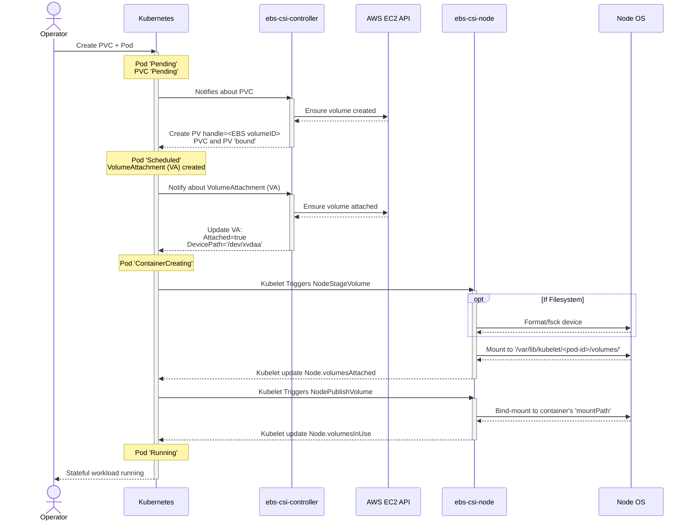
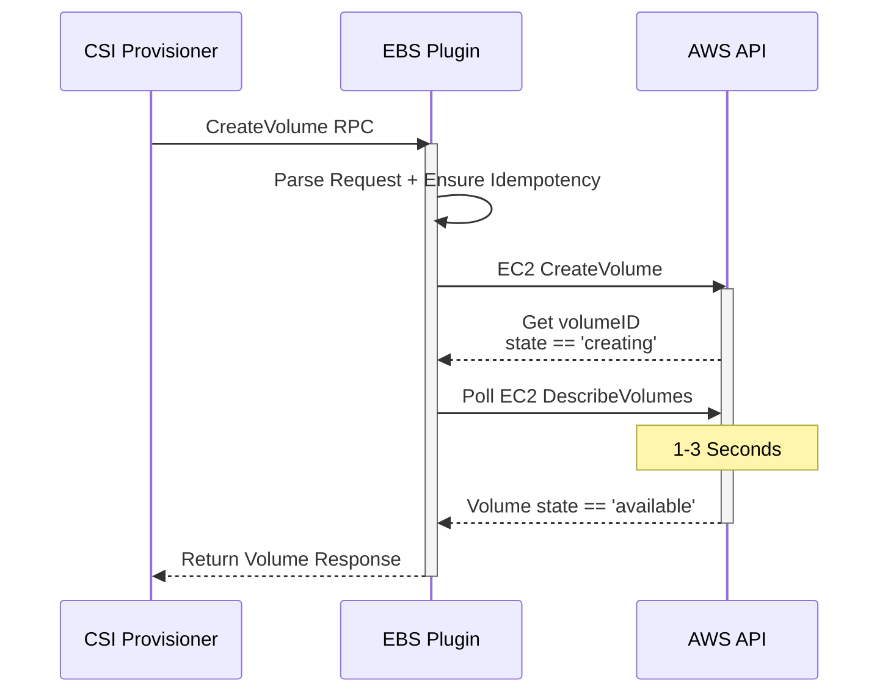
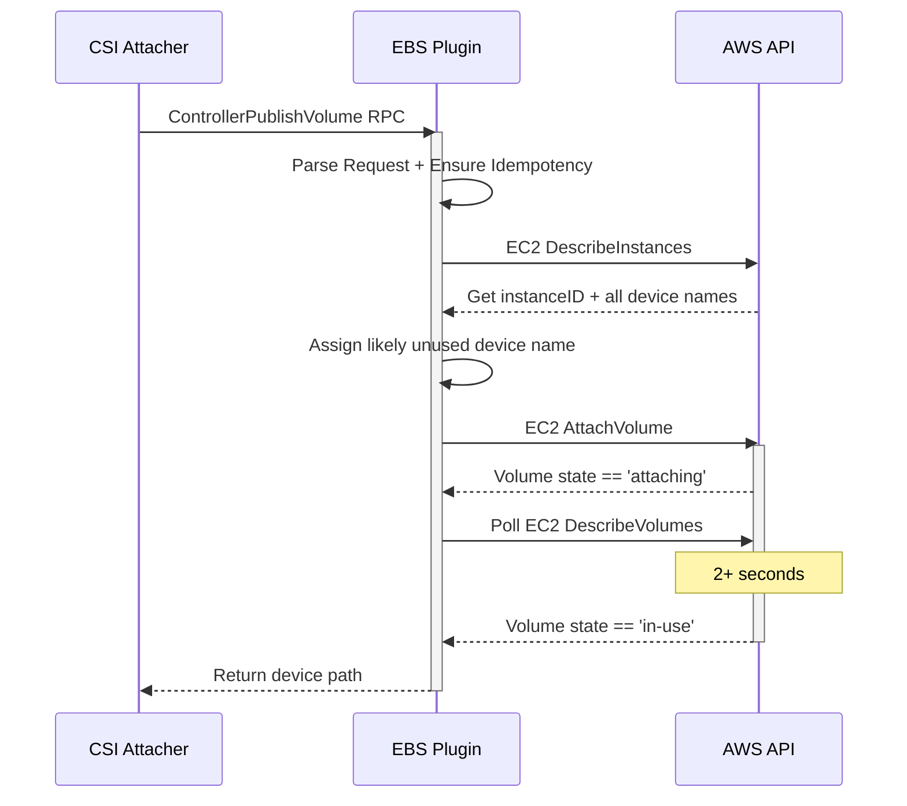
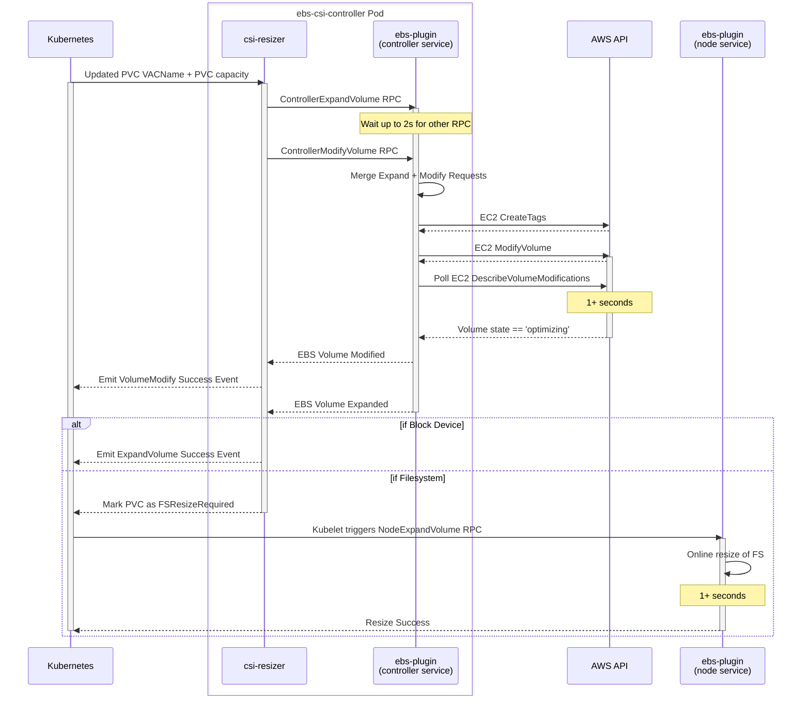

# AWS EBS CSI Driver

## EBS CSI Driver on Kubernetes

### High Level Summary

The EBS CSI Driver is used by Container Orchestrators to manage the lifecycle of AWS Elastic Block Storage Volumes. It is compliant to the [Container Storage Interface Specification](https://github.com/container-storage-interface/spec/blob/master/spec.md).

On Kubernetes (K8s), the driver is split into two components: the ebs-csi-controller Deployment and ebs-csi-node DaemonSet. 

The ebs-csi-controller watches K8s storage resources for changes, acts on those changes by making AWS EC2 API calls, and then updates those K8s resources once all associated EBS volumes reflect those changes. Inside the ebs-csi-controller pod are several CSI sidecar containers that interact with Kubernetes resources, as well as the ebs-plugin container which manages EBS Volumes via AWS API calls. The sidecars trigger these EBS volume operations by making CSI Remote Procedure Calls (RPCs) against the ebs-plugin's controller service. 

The ebs-csi-node DaemonSet ensures the Kubelet can manage the attached EBS storage devices via the ebs-plugin container. The Kubelet ensures these EBS volumes appear as block devices or mounted filesystem directories inside the container workloads, by triggering CSI RPCs against the ebs-plugin's node service.   

If you remember one thing from this document, remember that:
- ebs-csi-controller interacts with K8s storage resources, calls AWS EC2 APIs
- ebs-csi-node runs on every Node, used by Kubelet to perform privileged operations on attached storage devices

To illustrate these relationships between Kubernetes, the EBS CSI Driver, and AWS, we can look at what happens when you dynamically provision a volume for a given stateful workload:



## CSI Driver Design Requirements

### Idempotency

All CSI calls should be idempotent. The CSI plugin must ensure that a CSI call with the same parameters will always return the same result. Examples:

- CreateVolume call must first check that the requested EBS volume has been already provisioned and return it if so. It should create a new volume only when such volume does not exist.
- ControllerPublish (=i.e. attach) does not do anything and returns &quot;success&quot; when given volume is already attached to requested node.
- DeleteVolume does not do anything and returns success when given volume is already deleted (i.e. it does not exist, we don&#39;t need to check that it had existed and someone really deleted it)

Note that it&#39;s task of the ebs-plugin to make these calls idempotent even if the related AWS API call is not.

### Timeouts

gRPC always passes a timeout together with a request. After this timeout, the gRPC client call actually returns. The server (i.e. ebs-plugin) can continue processing the call and finish the operation, however it has no means how to inform the client about the result.

Kubernetes sidecars will retry failed calls, usually after some exponential backoff. These sidecars rely on idempotency here - i.e. when the plugin finished an operation after the client timed out, the plugin will get the same call again, and it should return success/error based on success/failure of the previous operation.

Example:

1. csi-attacher calls ControllerPublishVolume(vol1, nodeA) ), i.e. &quot;attach vol1 to nodeA&quot;.
2. ebs-plugin checks vol1 and sees it&#39;s not attached to nodeA yet. It calls EC2 AttachVolume(vol1, nodeA).
3. The attachment takes a long time, RPC times out.
4. csi-attacher sleeps for some time.
5. AWS finishes attaching of the volume.
6. csi-attacher re-issues ControllerPublishVolume(vol1, nodeA) again.
7. ebs-plugin checks vol1 and sees it is attached to nodeA and returns success immediately.

Note that there are some issues:

- Kubernetes can change its mind at any time. E.g. a user that wanted to run a pod on the node in the example got impatient so he deleted the pod at step 4. In this case csi-attacher will call ControllerUnpublishVolume(vol1, nodeA) to &quot;cancel&quot; the attachment request. It&#39;s up to the driver to do the right thing - e.g. wait until the volume is attached and then issue detach() and wait until the volume is detached and \*then\* return from
- Note that Kubernetes may time out waiting for ControllerUnpublishVolume too. In this case, it will keep calling it until it gets confirmation from the driver that the volume has been detached (i.e. until ebs-plugin returns either success or non-timeout error) or it needs the volume attached to the node again (and it will call ControllerPublishVolume in that case).
- The same applies to NodeStage and NodePublish calls (&quot;mount device, mount volume&quot;). These are typically much faster than attach/detach, still they must be idempotent when it comes to timeouts.

In summary, always check that if the required operation has already been done

### Restarts

The CSI driver should survive its own crashes or reboots of the node where it runs. For the controller service, Kubernetes will either start a new driver on a different node or re-elect a new leader of stand-by drivers. For the node service, Kubernetes will start a new driver shortly.

The ideal CSI driver is stateless. After start, it should recover its state by observing the actual status of AWS (i.e. describe instances / volumes).

### No credentials on nodes

General security requirements we follow in Kubernetes is &quot;if a node gets compromised then the damage is limited to the node&quot;. Paranoid people typically dedicate handful of nodes in Kubernetes cluster as &quot;infrastructure nodes&quot; and dedicate these nodes to run &quot;infrastructure pods&quot; only. Regular users can&#39;t run their pods there. CSI attacher and provisioner is an example of such &quot;infrastructure pod&quot; - it need permission to create/delete any PV in Kubernetes and CSI driver running there needs credentials to create/delete volumes in AWS.

There should be a way how to run the CSI driver (=container) in &quot;node mode&quot; only. Such driver would then respond only to node service RPCs and it would not have any credentials to AWS (or very limited credentials, e.g. only to Describe things). Paranoid people would deploy CSI driver in &quot;node only&quot; mode on all nodes where Kubernetes runs user containers.

### Cache of used / free device names

On AWS, it&#39;s the client who [must assign device names](https://aws.amazon.com/premiumsupport/knowledge-center/ebs-stuck-attaching/) to volumes when calling AWS.AttachVolume. At the same time, AWS [imposes some restrictions on the device names](https://docs.aws.amazon.com/AWSEC2/latest/UserGuide/device_naming.html).

Therefore, the ebs-plugin maintains a cache of used / free device names for each node. This cache is lost when the container restarts. We try to populate the cache during startup, however there are some corner cases when this fails. TODO: exact flow how we can get wrong cache.

## High level overview of CSI calls

TODO Question: Thoughts on turning this into a Markdown table? 

### Identity Service RPC

#### GetPluginInfo

Blindly return:

```
  Name: ebs.csi.aws.com
  VendorVersion: 1.x.y
```

#### GetPluginCapabilities

Blindly return:

```
   Capabilities:
     - CONTROLLER_SERVICE
     - ACCESSIBILITY_CONSTRAINTS
     - ...
```

#### Probe

- Check that the driver is configured can do simple AWS operations, e.g. describe volumes or so.
- This call is used by Kubernetes liveness probe to check that the driver is healthy. It&#39;s called every ~10 seconds, so it should not do anything &quot;expensive&quot; or time-consuming.  (10 seconds are configurable, we can recommend higher values).

### Controller Service RPC

#### CreateVolume

Checks that the requested volume was not created yet and creates it.

- Snapshot: if creating volume from snapshot, read the snapshot ID from request.



#### DeleteVolume

Checks if the required volume exists and is &quot;available&quot; (not attached anywhere) and deletes it if so. Returns success if the volume can&#39;t be found. Returns error if the volume is attached anywhere.

#### ControllerPublishVolume

- Checks that given volume is already attached to given node. Returns success if so.
- Checks that given volume is available (i.e. not attached to any other node) and returns error if it is attached.
- Chooses the right device name for the volume on the node (more on that below) and issues AttachVolume. TODO: this has complicated idempotency expectations. It cancels previously called ControllerUnpublishVolume that may be still in progress (i.e. AWS is still detaching the volume and Kubernetes now wants the volume to be attached back).



#### ControllerUnpublishVolume

Checks that given volume is not attached to given node. Returns success if so. Issues AWS.DetachVolume and marks the detached device name as free (more on that below). TODO: this has complicated idempotency expectations. It cancels previously called ControllerPublishVolume (i.e.AWS is still attaching the volume and Kubernetes now wants the volume to be detached).

#### ControllerExpandVolume

Checks that given volume is not expanded yet, calls EC2 ModifyVolume and ensures the modification enters the 'optimizing' state. 

Note: If ControllerModifyVolume is triggered within 2 seconds of ControllerExpandVolume, they will share an EC2 ModifyVolume call. 

#### ControllerModifyVolume

Checks if volume needs modification, calls EC2 ModifyVolume, and ensures modification enters 'optimizing' state.

- If tags need to be created/modified, call EC2 CreateTags. 

Note: If ControllerExpandVolume is triggered within 2 seconds of ControllerModifyVolume, they will share an EC2 ModifyVolume call.

#### ValidateVolumeCapabilities

Check whether access mode is supported for each capability

#### ListVolumes

Not implemented, Kubernetes does not need it.

#### GetCapacity

Not implemented, Kubernetes does not need it.

#### ControllerGetCapabilities

Blindly return:

```
  rpc:
    - CREATE\_DELETE\_VOLUME
    - PUBLISH\_UNPUBLISH\_VOLUME
    - ...
```

#### CreateSnapshot

Create a new snapshot from a source volume.

#### DeleteSnapshot

Deletes a snapshot.

#### ListSnapshots

List all EBS-CSI-Driver managed snapshots.

#### Not Implemented

- ListVolumes
- GetCapacity
- ControllerGetVolume

### Node Service RPC

#### NodeStageVolume

1. Find the device.
2. Check if it&#39;s unformatted (lsblk or blkid).
3. Format it if it&#39;s needed.
4. fsck it if it&#39;s already formatted + refuse to mount it on errors.
5. Mount it to given directory (with given mount options).

Steps 3 and 4 can take some time, so the driver must ensure idempotency somehow.

#### NodePublishVolume

Just bind-mount the volume.

#### NodeUnstageVolume

Just unmount the volume.

#### NodeUnpublishVolume

Just unmount the volume.

#### NodeExpandVolume

If the attached volume has been formatted with a filesystem, resize the filesystem.

#### NodeGetVolumeStats

#### NodeGetInfo

Blindly return:

```
    NodeId: AWS InstanceID.
    AccessibleTopology: {"topology.ebs.csi.aws.com/zone": [availablility zone]}
```

#### NodeGetId

Return AWS InstanceID.

#### NodeGetCapabilities

Blindly return:

```
  rpc:
    - STAGE\_UNSTAGE\_VOLUME
```

## Coalescing ControllerExpandVolume & ControllerModifyVolume

### EC2 ModifyVolume and Request Coalescing

AWS exposes one unified ModifyVolume API to change the size, volume-type, IOPS, or throughput of your volume. AWS imposes a 6-hour cooldown after a successful volume modification.

However, the CSI Specification exposes two separate RPCs that rely on ebs-plugin calling this EC2 ModifyVolume API: ControllerExpandVolume, for increasing volume size, and ControllerModifyVolume, for all other volume modifications. To avoid the 6-hour cooldown, we coalesce these separate expansion and modification requests by waiting for up to two seconds, and then perform one merged EC2 ModifyVolume API Call.

Here is an overview of what may happen when you patch a PVC's size and VolumeAttributesClassName at the same time:



## Driver modes

Traditionally, you run the CSI controllers together with the EBS driver in the same Kubernetes cluster.
Though, in some scenarios you might want to run the CSI controllers (csi-provisioner, csi-attacher, etc.) together with the EBS controller service of this driver separately from the Kubernetes cluster it serves (while the EBS driver with an activated node service still runs inside the cluster).
This may not necessarily have to be in the same AWS region.
Also, the controllers may not necessarily have to run on an AWS EC2 instance.
To support these cases, the AWS EBS CSI driver plugin supports three modes:

- `all`: This is the standard/default mode that is used for the mentioned traditional scenario. It assumes that the CSI controllers run together with the EBS driver in the same AWS cluster. It starts both the controller and the node service of the driver.\
Example 1: `/bin/aws-ebs-csi-driver --extra-volume-tags=foo=bar`\
Example 2: `/bin/aws-ebs-csi-driver all --extra-volume-tags=foo=bar`

- `controller`: This will only start the controller service of the CSI driver. It enables use-cases as mentioned above, e.g., running the CSI controllers outside of the Kubernetes cluster they serve. Still, this mode assumes that it runs in the same AWS region on an AWS EC2 instance. If this is not true you may overwrite the region by specifying the `AWS_REGION` environment variable (if not specified the controller will try to use the AWS EC2 metadata service to look it up dynamically).\
Example 1: `/bin/aws-ebs-csi-driver controller --extra-volume-tags=foo=bar`\
Example 2: `AWS_REGION=us-west-1 /bin/aws-ebs-csi-driver controller --extra-volume-tags=foo=bar`\

- `node`: This will only start the node service of the CSI driver.\
Example: `/bin/aws-ebs-csi-driver node --endpoint=unix://...`
